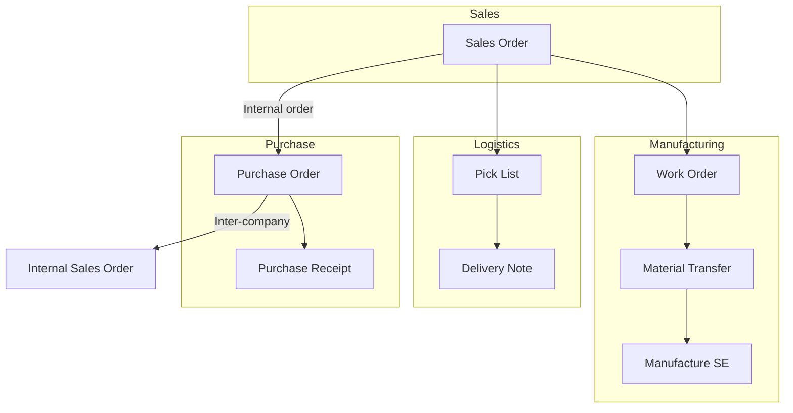

# NTPT ERP — Technical Documentation (Home)

Welcome to the **NTPT custom ERP** technical guides. These pages explain how **Sales**, **Purchase**, and **Logistics** work in your system—not generic ERPNext, but the **NTPT customizations** in `ntpt_erpnext_app`.

---

## Who is this for?

| Audience | Use this doc to… |
|----------|------------------|
| **New developers** | Find custom code, hooks, and validation rules |
| **Functional / QA** | Know expected behaviour and common blockers |
| **Operations** | Understand workflow order and document links |

---

## Custom app

Most behaviour described here lives in:

- **App:** `ntpt_erpnext_app`
- **Manufacturing extensions:** `ntpt_manufacturing` (Stock Entry, Job Card, Entity)

Standard ERPNext doctypes (Sales Order, Purchase Order, Pick List, Delivery Note) are **extended**, not replaced.

---

## Documentation map

| Topic | Wiki route | What you will learn |
|-------|------------|---------------------|
| **Sales** | [Sales — Technical Guide](/wiki/ntpt-tech-sales) | SO workflow, internal orders, B2C, payments, downstream documents |
| **Purchase** | [Purchase — Technical Guide](/wiki/ntpt-tech-purchase) | PO workflow, approvals, internal PO, receipts, supplier rules |
| **Logistics** | [Logistics — Technical Guide](/wiki/ntpt-tech-logistics) | SO → Pick List → Delivery Note, entities, packages |
| **Manufacturing** | [Manufacturing — SO to Stock Entry](/wiki/ntpt-tech-manufacturing) | B2C SO → WO → MT → Manufacture SE, WO-direct Shafts/Golf flow |

---

## High-level process map

---

## Quick rules (read first)

1. **Sales Order** must have **Delivery Terms** before submit.
2. **Internal customer orders** may require an **Internal PO** and **Internal SO** before the main SO workflow can move forward.
3. **Pick List** is created with **manual picking** (`pick_manually = 1`); warehouse and batch are usually set on the **Delivery Note**, not on the Pick List.
4. **Delivery Note** submit needs **warehouse**, and often **scanned entities / packages** for containerized items.
5. **Purchase Receipt** from PO needs **selected items** in `custom_selected_items_json` (custom mapper).

---

## Glossary

| Term | Meaning |
|------|---------|
| **IC / Internal** | Inter-company order between NTPT entities (e.g. US ↔ Poland) |
| **Initial SO** | Customer-facing Sales Order |
| **Internal SO** | Sales Order on the supplying company, linked to Internal PO |
| **Internal PO** | Purchase Order raised against the initial SO (`custom_internal_sales_order`) |
| **Entity** | Serialized container / batch unit used in logistics and manufacturing |
| **FOC** | Free of charge — special rate handling on several doctypes |

---

## Need help?

- **Code:** `apps/ntpt_erpnext_app/ntpt_erpnext_app/doctype/`
- **Workflows:** Workflow fixtures in `ntpt_erpnext_app` (Sales Order, Purchase Order, Pick List, Delivery Note)
- **Functional tests:** `ntpt_erpnext_app/functional_tests/` (run via `bench --site <site> execute …`)

_Last updated: technical documentation generated for NTPT ERP custom flows._
