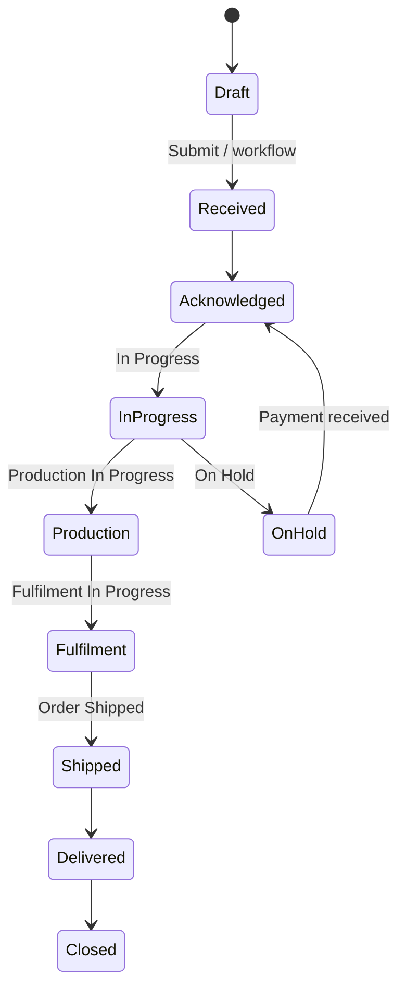
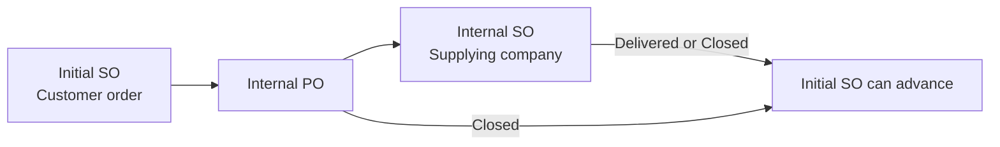

# Sales — Technical Guide

This page documents the **custom Sales Order** flow in NTPT ERP.

---

## 1. Overview

A **Sales Order (SO)** is the starting point for selling to a customer. In NTPT:

- SO uses a **custom workflow** (not only ERPNext `status`).
- SO can trigger **internal inter-company** Purchase Orders and Sales Orders.
- B2C web orders can **auto-create BOMs and Work Orders** on submit.
- SO connects to **Pick List**, **Delivery Note**, **Sales Invoice**, **Work Order**, and **Payment Request**.

**Custom class:** `CustomSalesOrder`  
**Path:** `ntpt_erpnext_app/doctype/sales_order/sales_order.py`

---

## 2. Document lifecycle (simple view)

> Exact state names and allowed transitions are defined in the **Workflow** doctype: `Sales Order`.

---

## 3. Create and submit a Sales Order

### 3.1 Required before submit

| Check | Rule | Error if missing |
|-------|------|------------------|
| Delivery Terms | Field `delivery_terms` must be set | *"Please set Delivery Terms before submitting the Sales Order."* |
| Standard ERPNext | Customer, items, company, etc. | Standard ERPNext messages |

**Code:** `CustomSalesOrder.on_submit()`

### 3.2 What happens on save (`before_save`)

- Line-item change tracking → `custom_item_edited`
- Bank details from **Bank Details** by currency + company
- Item count fields updated
- **Customer ref** on lines from Item Customer Detail

### 3.3 What happens after insert (B2C / WooCommerce)

For **B2C Website** + **Shopping Cart** + **TPTGolf**:

- Taxes may be rebuilt from WooCommerce / Tax Rule
- **Shipping rule** may be applied via `update_shipping_rule`

---

## 4. Internal (inter-company) orders

### 4.1 When it applies

If **`custom_internal_order_required = 1`** on the **initial customer SO**, the system enforces a chain before certain **forward workflow** steps.

### 4.2 Chain (order matters)

| Step | Document | Requirement for initial SO to move forward |
|------|----------|------------------------------------------|
| 1 | **Internal PO** | Linked via `custom_internal_sales_order` → initial SO name |
| 2 | **Internal SO** | Submitted; workflow **Delivered** or **Closed** |
| 3 | **Internal PO** | Workflow **Closed** |

**Important:** Until an Internal PO exists, the gate **does not run**—workflow can still move on the initial SO.

**Code:** `_validate_internal_so_delivery_for_next_workflow_action()`

### 4.3 Auto-create Internal PO (B2C)

After submit, if:

- `custom_internal_order_required = 1`
- `custom_source_of_order = B2C Website`

→ UI may call **`create_internal_po`** automatically (`maybe_auto_create_internal_po` in `sales_order.js`).

### 4.4 Common blocker (operations)

Example error when advancing workflow:

> Internal Sales Order **PL-TPT-IC-26-0042** must be in workflow state Delivered or Closed (current: **On Hold**)

**Fix:** Complete internal fulfilment on the Internal SO and PO first, then return to the customer SO.

---

## 5. B2C — Auto BOM and Work Order

On **submit**, when **NTPT Settings**:

- `auto_create_bom = 1`
- `custom_source_of_order = B2C Website`
- `order_type = Shopping Cart`

→ **`create_boms_from_comment()`** runs:

1. Reads **`custom_comment`** on SO lines (shaft / adapter / grip).
2. Creates or reuses **BOM**.
3. Optionally creates **Work Order** if `auto_create_work_order = 1`.

Failures are logged to **Error Log**; WO errors may not always show as a popup.

---

## 6. Payment and Work Order

| Field | Effect |
|-------|--------|
| `custom_payment_status = On Hold` | **Work Order** creation blocked: *"Linked Sales Order Payment is on Hold…"* |

**Code:** `CustomWorkOrder.validate()` in `work_order.py`

Payment received while SO workflow is **On Hold** may auto-move workflow back to **Acknowledged** (`before_update_after_submit`).

---

## 7. Actions from Sales Order (UI / API)

| Button / API | Method | Creates |
|--------------|--------|---------|
| Pick List | `create_pick_list_with_comment` | Pick List (with package comment) |
| Delivery Note | ERPNext `make_delivery_note` | DN (direct—no PL link) |
| Sales Invoice | Overridden `make_sales_invoice` | Sales Invoice |
| Work Order | ERPNext `make_work_orders` | Work Order |
| Material Request | ERPNext | Material Request |
| Purchase Order | Custom dialogs | PO to suppliers |
| Internal PO | `create_internal_po` | Internal PO |
| Payment Request | `create_payment_request_from_sos` | Payment Request |

**Dashboard connections:** `sales_order_dashboard.get_data` — includes internal SO link via `custom_sale_order`.

---

## 8. Scheduled jobs

| Schedule | Function | Purpose |
|----------|----------|---------|
| Daily | `check_payment_due_date` | Payment due reminders |
| Daily | Order allocation report | Reporting |

---

## 9. Warehouse validation

Standard ERPNext **warehouse validation on SO is disabled** intentionally (`validate_warehouse` overridden to `pass`). Stock checks happen later (Pick List / DN / manufacturing).

---

## 10. Testing checklist (QA)

| # | Test | Expected |
|---|------|----------|
| 1 | Submit SO without Delivery Terms | Blocked |
| 2 | Submit SO with Delivery Terms | Submitted |
| 3 | Advance SO with internal chain incomplete | Blocked with Internal SO/PO message |
| 4 | Create Pick List from SO | PL saved, `pick_manually=1`, comment copied |
| 5 | Create WO when payment On Hold | Blocked |
| 6 | B2C SO with comment | BOM/WO per settings |

**Run:** `bench --site ntpt execute ntpt_erpnext_app.functional_tests.run_so_functional_tests.run`

---

## 11. Related pages

- [Logistics — Technical Guide](/wiki/ntpt-tech-logistics) — SO → Pick List → DN
- [Purchase — Technical Guide](/wiki/ntpt-tech-purchase) — Internal PO
- [Home](/wiki/ntpt-tech-home)
