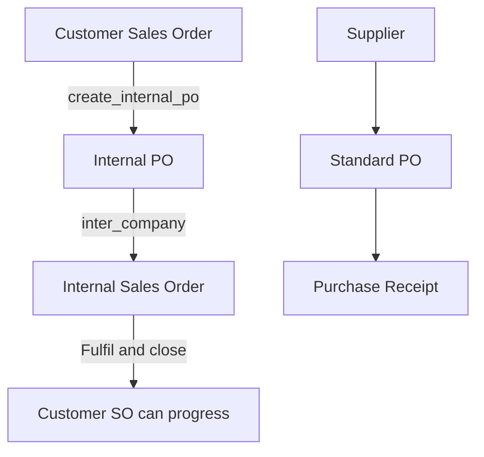

# Purchase — Technical Guide

This page documents the **custom Purchase Order (PO)** and related buying flows in NTPT ERP.

---

## 1. Overview

**Purchase Order** covers buying from suppliers and **internal inter-company** purchases linked to customer Sales Orders.

**Custom class:** `CustomPurchaseOrder`  
**Path:** `ntpt_erpnext_app/doctype/purchase_order/purchase_order.py`

**Related documents:** Purchase Receipt, Purchase Invoice, Internal Sales Order (from SO).

---

## 2. Two types of PO

| Type | Flag / sign | Purpose |
|------|-------------|---------|
| **Standard PO** | `custom_internal_po = 0` | Buy from external supplier |
| **Internal PO** | `custom_internal_po = 1` | Inter-company; linked to customer SO via `custom_internal_sales_order` |

---

## 3. Purchase Order workflow

Workflow name: **Purchase Order** (fixture in `ntpt_erpnext_app`).

Typical states (see Workflow for full list):

- Draft → Reviewed → Approval Pending → Approved → In Progress → … → Closed / Cancelled / Rejected

**List view** loads workflow filters via `get_purchase_order_workflow_state`.

### 3.1 Approval and email (UI)

`purchase_order.js` handles:

- **Reject / Reverse / Close** — may require reason dialog (`before_workflow_action`)
- **Ask for Approval** — may require mail confirmation
- **Approver mail** — `approver_mail` API
- **Supplier mail** — `supplier_mail` → moves toward **Pending Supplier Confirmation**

### 3.2 On submit

- Sets **`submitted_by`** on the PO (SQL update in `on_submit` hook)

### 3.3 On insert (`before_insert`)

- **`custom_creator_id`** from User abbreviation
- **Contact person** pulled from Supplier (`update_contact_person`)

---

## 4. Validations and business rules

### 4.1 Supplier contact email

On **validate** (via `calculate_the_total_standard_rate` hook):

- If **stock items** on PO (`custom_service_item = 0`) and **no `contact_email`**:
  - **Throws:** *"Please set the supplier contact mail"*

Contact may be auto-filled from Supplier primary contact on validate.

### 4.2 Internal PO delivery terms

When `custom_internal_po = 1` and `represents_company` is set:

- **`apply_internal_delivery_terms`** runs (same rules as Sales — FCA/DDP by company pair, named place Żory)

**API:** `get_internal_delivery_terms_for_purchase_order`

### 4.3 Incoterms from supplier

**API:** `list_shipping_incoterm` — reads **Incoterm and Shipment Rule** child table on Supplier.

**API:** `update_namedPlace_from_delivery_terms` — sets named place and description.

### 4.4 Standard rate / approver routing

`calculate_the_total_standard_rate` also:

- Sets `custom_grand_total_excluding_tax`
- Sets `custom_user` from **User Rate Mapping** on Company (Greater / Lesser thresholds)
- Flags `custom_service_item` if any line is non-stock

---

## 5. Create Purchase Receipt from PO

NTPT uses a **custom mapper**, not only ERPNext default.

**Method:** `make_purchase_receipt(source_name)`

### 5.1 Required: selected items JSON

Field on PO: **`custom_selected_items_json`**

| Situation | Result |
|-----------|--------|
| Field empty / null | **Bug risk:** JSON parse error instead of friendly message |
| `[]` empty array | *"No items selected for the Purchase Receipt."* |
| Valid JSON with `item_code` + `selected_qty` | Purchase Receipt draft with quantities |

**Rule:** `selected_qty` cannot exceed **pending qty** (`qty - received_qty`).

### 5.2 UI flow

1. Open submitted PO.
2. Select lines and quantities (stored in `custom_selected_items_json`).
3. **Create → Purchase Receipt** (custom button / mapper).

---

## 6. Internal PO ↔ Sales Order

| PO field | Links to |
|----------|----------|
| `custom_internal_sales_order` | Initial customer **Sales Order** name |
| `inter_company_order_reference` | Used on Internal **Sales Order** side |

When Internal PO workflow moves to **In Progress** (`after_workflow_action` in JS):

- Customer SO `workflow_state` may be set to **In Progress**

**Closing PO:** `close_purchase_order` — force workflow **Closed** (bypasses workflow validation; use with care).

---

## 7. Other whitelisted APIs

| API | Purpose |
|-----|---------|
| `get_supplier_ids` | Email list for supplier contacts |
| `get_address` | HTML formatted address |
| `get_item_uom_list` | UOM search for items |
| `custom_item_query` | Item search (LIKE) for Add Multiple |
| `change_workflow_state` | Direct workflow state update |
| `make_order_cancelled` | Set docstatus cancelled |

---

## 8. Dashboard connections

**Purchase Order** dashboard shows:

- Purchase Receipt, Purchase Invoice, **Sales Order** (internal link)
- Payment entries, Material Request, BOM, etc.

**Method:** `purchase_order_dashboard.get_data`

---

## 9. Common blockers (operations)

| Symptom | Likely cause | Action |
|---------|--------------|--------|
| Cannot create PR | No items in `custom_selected_items_json` | Select items on PO first |
| JSON error on PR | Field null | Select items; avoid empty null JSON |
| Cannot save PO | Missing supplier email | Set Supplier contact / PO contact email |
| Customer SO stuck | Internal PO not **Closed** | Close internal PO after internal SO delivered |
| Approval stuck | Mail confirmation not done | Complete approval email flow in UI |

---

## 10. Testing checklist (QA)

| # | Test | Expected |
|---|------|----------|
| 1 | `get_purchase_order_workflow_state` | Returns state list |
| 2 | Internal PO delivery terms API | DDP/FCA + named place |
| 3 | PR without selected items | Error message |
| 4 | PR with selected items | PR draft |
| 5 | `make_purchase_invoice` from PO | PI draft |
| 6 | `close_purchase_order` | Workflow Closed |
| 7 | Internal PO linked to SO | `custom_internal_sales_order` matches |

**Run:** `bench --site ntpt execute ntpt_erpnext_app.functional_tests.run_po_functional_tests.run`

---

## 11. Related pages

- [Sales — Technical Guide](/wiki/ntpt-tech-sales) — Internal order chain
- [Logistics — Technical Guide](/wiki/ntpt-tech-logistics)
- [Home](/wiki/ntpt-tech-home)
