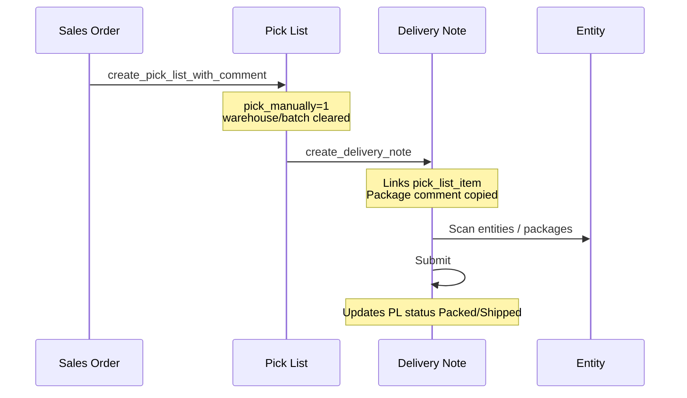

# Logistics — Technical Guide

This page documents the **Sales Order → Pick List → Delivery Note** flow and related NTPT customizations.

---

## 1. Overview

**Logistics** in NTPT means fulfilling customer orders physically:

1. **Sales Order** — what to ship  
2. **Pick List** — plan what to pick (manual mode; warehouse often blank here)  
3. **Delivery Note** — ship, scan **entities**, assign **packages**, submit  

**Apps involved:** `ntpt_erpnext_app` (Pick List, DN), `ntpt_manufacturing` (Entity, containers)

---

## 2. End-to-end flow



---

## 3. Step 1 — Sales Order → Pick List

### 3.1 How to create (UI)

**Single SO:** **Sales Order** → **Create** → **Pick List** (with optional comment dialog).

**Multiple SOs (same customer):** Create a draft **Pick List** → set **Customer** → **Get Items** → select multiple Sales Orders. NTPT applies manual-pick rules and saves automatically.

### 3.2 What the custom code does

**Single SO method:** `create_pick_list_with_comment(source_name, comment)`

**Multi-SO method:** Pick List **Get Items** → `map_docs` → `apply_ntpt_manual_pick_rules_for_doc`

| Setting | Value | Why |
|---------|-------|-----|
| `pick_manually` | `1` | User assigns batch/warehouse on DN, not auto-split on PL |
| `custom_package_print_comment` | From dialog (single SO) or manual on PL | Prints on DN / labels |
| Location `warehouse` | Cleared (`""`) | Stock allocation at DN |
| Location `batch_no` / serial | Cleared | Same reason |
| `custom_mrp_order_id` | Comma-separated from all item SOs | Multi-SO list view / filters |

Then calls ERPNext `create_pick_list` and saves with `ignore_mandatory`.

**On insert / validate:** `sync_pick_list_header_from_sales_orders` copies SO / line comments → `custom_so_customer_comment`.

### 3.3 Multi-SO constraints

- All Sales Orders on one Pick List must share the **same customer** (ERPNext Get Items filter).
- SOs must be submitted, not fully delivered, and must not have reserved stock.

### 3.4 Pick List validate (containers)

If items are **containerized** (`is_containerized` on Item):

- `calculate_the_total_standard_rate` may assign **entities** to rows and build HTML table `custom_containers_information_text`.

Requires warehouse on row for container query—empty warehouse skips assignment.

### 3.5 Submitting Pick List

| Scenario | Behaviour |
|----------|-----------|
| Warehouse empty, user sets **picked qty** | Often **fails**: *"picked quantity … greater than available stock … in warehouse …"* |
| NTPT intended path | Keep PL as draft or submit without forcing picked qty; create **DN from PL** |
| Submit with qty | Uses ERPNext stock validation against Bin |

**Do not** fill picked quantity on PL rows if warehouse is empty—set stock details on **Delivery Note** instead.

---

## 4. Step 2 — Pick List → Delivery Note

### 4.1 How to create (UI)

**Pick List** → **Create** → **Delivery Note**  
(or ERPNext menu equivalent)

**Method:** `erpnext.stock.doctype.pick_list.pick_list.create_delivery_note`

Works from **draft or submitted** Pick List (tested on site).

### 4.2 NTPT batch / qty sync (important)

Hooks patch ERPNext `map_pl_locations`:

**Module:** `delivery_note/dn_pick_list_batch.py`  
**Function:** `map_pl_locations_with_pick_list_sync`

After standard mapping, for each Pick List location linked to a DN row:

- Copies **qty**, **stock_qty**, **batch_no**, **warehouse**, **serial** / bundle from PL row
- Uses `picked_qty` or `stock_qty` logic when `picked_qty` is zero

### 4.3 What to verify on DN draft

| Field / link | Expected |
|--------------|----------|
| `against_pick_list` | Pick List name |
| `pick_list_item` | Pick List Item row name |
| `custom_package_print_comment` | From PL comment(s) |
| `custom_sales_orders` | Table MultiSelect — all linked Sales Orders |
| Item `against_sales_order` | Per-line Sales Order reference |
| Item qty | Should match PL pending qty (not zero rows) |

**API for UI batch sync:** `get_pick_list_item_batch_map(pick_list_item_rows)`

---

## 5. Step 3 — Delivery Note (draft save)

`CustomDeliveryNote.before_save` does several things:

### 5.1 Pick List status

- May call **`update_pick_list_to_ready_to_ship`** when DN is draft saved.

### 5.2 Scanned entities

Table: **`custom_scanned_entities`**

- Entities grouped by `item_code` → assigned to DN item rows → `container_list` on items.

### 5.3 Packages

Table: **`custom_packages`**

- Net weight vs gross weight validation  
- Package IDs must be unique  
- Scanned entities must reference valid package IDs when both tables used  

### 5.4 Weights / UOM

- **`calculate_entity_weights_from_uom`** — requires KG conversion configured on Item UOM.

### 5.5 Warehouse rule (draft)

For stock items linked to **manual Pick List** draft DN:

- Missing warehouse on item may be **allowed on draft save** (`_is_manual_pick_list_draft_item`).

---

## 6. Step 4 — Submit Delivery Note

### 6.1 Typical blockers (in order)

| # | Validation | Message type |
|---|------------|----------------|
| 1 | Stock item without warehouse | *"Warehouse required for stock Item …"* |
| 2 | Missing entity UOM to KG | *"configure valid Item Weight UOM…"* |
| 3 | Package / entity rules | Package ID, duplicate package, entity package reference |
| 4 | Shipment detail rows | `validate_dn_shipment_detail_rows` |

**before_submit:** `update_dn_details_entity` — writes Entity `delivery_document_*` fields from `container_list`.

**on_submit:**

- Updates **Pick List** toward **Packed / Shipped** (`update_pick_list_to_shipped`)
- Posting date if not set manually
- Return DN has special entity quantity handling

---

## 7. SO → DN direct (bypass Pick List)

ERPNext **Create → Delivery Note** from **Sales Order** still works.

| Path | `against_pick_list` | Use when |
|------|---------------------|----------|
| SO → DN direct | Empty | Quick delivery; **no** PL traceability |
| SO → PL → DN | Set | **Standard NTPT logistics** |

---

## 8. Pick List hook patch

On app install/load (`hooks.py`):

```text
standard_pick_list.map_pl_locations
  → map_pl_locations_with_pick_list_sync
```

If patch missing: error *"Pick List map_pl_locations is not initialized"*.

---

## 9. Roles and documents (reference)

| DocType | Custom class | Key hooks |
|---------|--------------|-----------|
| Pick List | `CustomPickList` | `before_insert`, `validate` → standard rate / containers |
| Delivery Note | `CustomDeliveryNote` | `validate`, `before_save`, `before_submit`, `on_submit` |

**Workflows:** Pick List, Delivery Note (fixtures in `ntpt_erpnext_app`).

**Cron:** `auto_mark_delivery_notes_delivered` — overdue DN handling.

---

## 10. Operations playbook

### Happy path

1. Submit **Sales Order** (Delivery Terms set).  
2. **Create Pick List** + enter package comment.  
3. **Create Delivery Note** from Pick List.  
4. On DN: set **warehouse** / **batch** per line (or scan flow in UI).  
5. Scan **entities** and define **packages** (containerized items).  
6. **Submit** Delivery Note.  
7. Confirm **Pick List** status updated.

### When things go wrong

| Problem | Check |
|---------|-------|
| PL save fails on qty | Warehouse empty—move qty assignment to DN |
| DN lines qty = 0 | PL `picked_qty` / mapping; re-create DN from PL |
| Cannot submit DN | Warehouse, entities, packages, UOM KG |
| Batch not on DN line | `get_pick_list_item_batch_map` / manual batch on DN |
| SO not delivered % | DN not submitted or wrong SO link |

---

## 11. Testing checklist (QA)

| # | Test | Expected |
|---|------|----------|
| 1 | SO → Pick List | PL manual=1, comment set, WH cleared |
| 2 | PL → DN | `against_pick_list`, `pick_list_item`, comment copied |
| 3 | Submit DN without warehouse | Blocked |
| 4 | `map_pl_locations` patched | `map_pl_locations_with_pick_list_sync` |
| 5 | SO → DN direct | No pick list link |
| 6 | Multi-SO Get Items → PL → DN | Both SOs on items + `custom_sales_orders` |

**Run:** `bench --site ntpt execute ntpt_erpnext_app.functional_tests.run_logistics_flow_tests.run`

---

## 12. Related pages

- [Sales — Technical Guide](/wiki/ntpt-tech-sales)
- [Purchase — Technical Guide](/wiki/ntpt-tech-purchase)
- [Home](/wiki/ntpt-tech-home)
